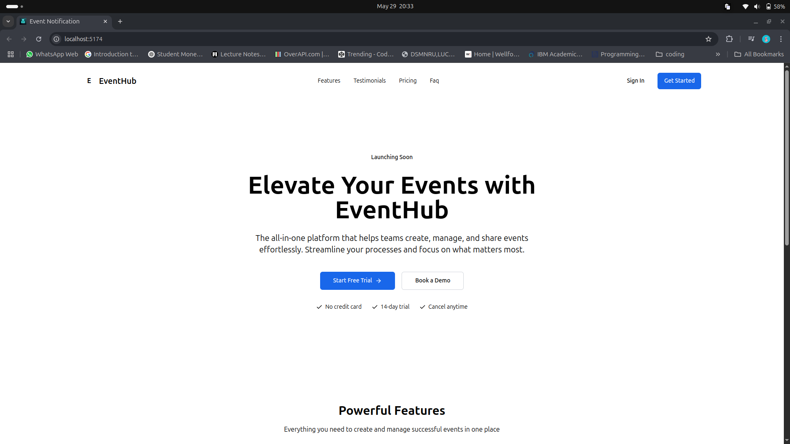

# Event_Notification

# 📢 Real-Time Event Notification System

A real-time notification platform built using the MERN stack and WebSockets. This app allows an admin to notify connected users instantly about upcoming events. Designed with responsiveness, modularity, and performance in mind.

## Demo 



## 🔥 Features

- 🧑‍💼 Admin can send event notifications in real time
- 🌐 WebSocket (Socket.io) based communication
- 🧵 Scalable real-time architecture
- ⚡ Responsive UI with Tailwind CSS
- 🔐 Basic authentication and session management

## 🧰 Tech Stack

- **Frontend**: React, Tailwind CSS
- **Backend**: Node.js, Express.js, Socket.io
- **Database**: MongoDB with Mongoose
- **Real-Time Engine**: WebSocket using Socket.io
- **Dev Tools**: Git, GitHub, VS Code

## 📦 Installation

To run this project locally:

```bash
# Clone the repo
git clone https://github.com/Sagolsa78/Event_Notification.git
cd Event_Notification

# Install backend dependencies
cd backend
npm install

# Install frontend dependencies
cd ../frontend
npm install

# Run backend server
cd ../backend
npm start

# Run frontend app
cd ../frontend
npm start

```

## 🧠 Concepts Covered
WebSocket and Socket.io implementation

Real-time bidirectional communication

MERN stack integration

Component-based architecture

Modular and reusable code structure

## 🤝 Contributing
Feel free to fork the repository and open a pull request with improvements or new features!

## 📄 License
This project is open source and available under the MIT License.

## 📬 Contact
Mohit Sahani

Email: sahanimohit5ed@gmail.com 

GitHub: @Sagolsa78

Portfolio: myportfolio-two-delta-35.vercel.app
